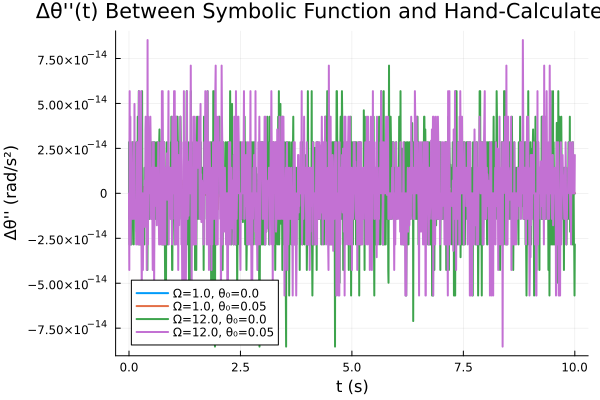

# **ME 5180: Advanced Dynamics | Project 01 | Group 06**

# Group Members:
[Christian DiPietrantonio](mailto:hwp25002@uconn.edu)

## Project Overview: 

In this project, a pendulum is attached to a spinning frame. The frame has dimensions, 

$h_1 = 0.2~m$

$w_1 = 0.1~m$

and the pendulum length is $L=0.15$ m with a $m=0.1$ kg point mass at the end of the system. The pendulum swings in the $x'$ - $z'$ plane as it rotates at a constant speed, $\Omega$


Your team's goal is to 

- build the equations of motion using Lagrange and least action $L=T-V$
- solve for the motion for a slow rotation speed and a fast rotation speed
- visualize the solution with plots and animations

## Running the Program:

From the project directory, run:

```bash
julia main.jl 
```

The program may take a few minutes to run. All final plots are output to the `results/` directory and use the following naming convention: `plottype_omega_value_theta_value.extension`. The types of animated plots are:
- 3d Trajectory Plots
- Theta versus time
- Theta dot versus time
- Dashboards (which include the three above)

The non-animated plots are:
- 3d Trajectories (for the slow and fast rotation speed)
- Theta versus time (for the slow and fast rotation speed)
- Angular acceleration difference (between the symbolic Equation of Motion (EOM) found using Julia and the EOM derived by hand below)

All source code is in the `src/` directory.

## Project Structure
TBD

## Results
Four specific cases were evaluated, the results of which can be seen below. 
<p align="center">
    
</p>
<p align="center">
    
</p>
<p align="center">
    
</p>
<p align="center">
    
</p>

A note on accuracy. As mentioned previously, to explore the symbolic capabilities of Julia, ModelingToolkit was used to derive the EOM for the pendulum symbolically (but following the same procedure as the derivation below). To evaluate the accuracy of doing this, the following plot was created to find the difference between the symbolic EOM and the one derived by hand.

<p align="center">
    
</p>

From this plot, we observe that the for all cases evaluated, the magnitude of the error never exceeds approximately $7.5 \cdot 10^{-14}$, which is effectively zero. The variation in the error values at each time step suggests that the observed error is due to floating point arithmetic and machine precision limitations. 


## Analysis:

To solve this problem, we can define a reference frame that rotates with the pivot about the z-axis. At time t, the rotating reference frame rotates by $\phi(t) = \Omega t$ relative to the inertial frame. Consider a vector $\vec{v} = x' \widehat{i'} + y' \widehat{j'} = x \widehat{i} + y \widehat{j}$. We know that $\widehat{i'} = \cos(\phi) \widehat{i} + \sin(\phi) \widehat{j}$ and $\widehat{j'} = \cos(90^\circ + \phi) \widehat{i} + \sin(90^\circ + \phi) \widehat{j} = -\sin(\phi) \widehat{i} + \cos(\phi) \widehat{j}$. We also know that $z = z'$. Now, since the trajectory of the pendulum is defined in the inertial frame, we must introduce a method to transform coordinates from the rotational frame back to the inertial frame. Using our original expression for $\vec{v}$, we can substitute the expressions for $\widehat{i'}$ and $\widehat{j'}$ to find a rotation matrix about the z-axis, $R_{z}(\phi)$, such that

$$
\begin{bmatrix}
x \\
y \\
z
\end{bmatrix} = R_z(\phi)
\begin{bmatrix}
x' \\
y' \\
z'
\end{bmatrix}
$$

Doing so yields:

$$
R_z(\phi) = 
\begin{bmatrix}
\cos \phi & -\sin \phi & 0 \\
\sin \phi & \cos \phi & 0 \\
0 & 0 & 1
\end{bmatrix}
$$

We can now convert the position of the pivot and the mass from the rotating frame to the inertial frame. For the pivot (in the rotating frame):

$$
\vec{r'}_{Pivot} = 
\begin{bmatrix}
w_1 \\
0 \\
h_1
\end{bmatrix}
$$

Therefore, the pivot position in the inertial frame can be expressed as:
$$
\vec{r}_{Pivot} = 
\begin{bmatrix}
w_1 \cos(\Omega t) \\
w_1 \sin(\Omega t) \\
h_1
\end{bmatrix}
$$

The position of the mass the rotating frame relative to the pivot can be expressed as:

$$
\vec{r'}_{Mass, rel} = 
\begin{bmatrix}
L \sin(\theta) \\
0 \\
-L \cos(\theta)
\end{bmatrix}
$$

Where $\theta$ is the angle in the $x'- z'$ plane between the pendulum and the vertical $z'$ axis. Therefore, the position of the mass can be expressed in the inertial frame as:

$$
\vec{r}_{Mass, rel} = 
\begin{bmatrix}
L \sin(\theta) \cos(\Omega t) \\
L \sin(\theta) \sin(\Omega t) \\
-L \cos(\theta)
\end{bmatrix}
$$

The absolute position of the mass in the inertial frame can then be expressed as:

$$
\vec{r}_{Mass} = \vec{r}_{Pivot} + \vec{r}_{Mass, rel} = 
\begin{bmatrix}
\cos(\Omega t)\left[w_1 + L \sin \theta (t)\right] \\
\sin(\Omega t)\left[w_1 + L \sin \theta (t)\right] \\
h_1 - L \cos \theta (t)
\end{bmatrix}
$$

Therefore:

$$
x(t) = \cos(\Omega t)\left[w_1 + L \sin \theta (t)\right]
$$

$$
y(t) = \sin(\Omega t)\left[w_1 + L \sin \theta (t)\right]
$$

$$
z(t) = h_1 - L \cos \theta (t)
$$

Taking the time-derivative of each allows us to find the speed of the mass, which can then be used to find the kinetic energy of the system:

$$
T = \frac{1}{2} m \left[L^2 \dot{\theta}(t)^2 + \Omega^2 (w_1 + L \sin \theta (t)^2) \right]
$$

The potential energy of the system can also be expressed as:

$$
V = mg \left(h_1 - L \cos \theta (t) \right)
$$

We can now write the Lagrangian as:

$$
L = T - V = \frac{1}{2} m \left[L^2 \dot{\theta}(t)^2 + \Omega^2 (w_1 + L \sin \theta (t)^2) \right] - mg \left(h_1 - L \cos \theta (t) \right)
$$

Finally we can used the Euler-Lagrange equation, $\frac{d}{dt}\left(\frac{\partial L}{\partial \dot{\theta}} \right) - \frac{\partial L}{\partial \theta} = 0 $, to find the equation of motion for the system:

$$
\ddot{\theta}(t) = \frac{\Omega^2}{L} \left(w_1 + L \sin \theta (t) \right) \cos \theta (t) - \frac{g}{L} \sin \theta (t)
$$

**Please note, a full derivation of the equation above can be found in the project01_team06_notes.pdf file in the notes directory of the repository.** 

Now, in order to program this system in Julia, we must decompose the second-order ODE above into two first-order ODEs. We can do that by defining:

$$
\begin{aligned}
u_1 = \theta \\
u_2 = \dot{\theta}
\end{aligned}
$$

Therefore, we have:

$$
\begin{aligned}
\dot{u}_1 &= u_2 \\
\dot{u}_2 &= \frac{\Omega^2}{L} \left(w_1 + L \sin \theta (t) \right) \cos \theta (t) - \frac{g}{L} \sin \theta (t)
\end{aligned}
$$

Finally, we must determine a low and high speed for $\Omega$. Given that the natural frequency of the pendulum is

$$
\omega_o = \sqrt{\frac{g}{L}} = \sqrt{\frac{9.81}{0.15}} \approx 8.08 \: \text{rad/s}
$$

Therefore, we can choose a low speed of $ \Omega_s = 1$ rad/s and a high speed of $\Omega_f = 12$ rad/s. We can also evaluate the cases where the pendulum starts at rest, $\theta_o = 0$, and where the pendulum starts with a small displacement, $\theta_o = 0.25$ rad.
